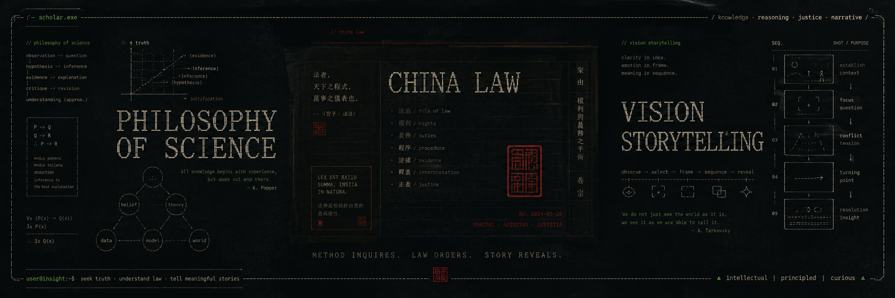

## Hi there 👋

  

<h1 align="center">Hi, I'm Ansatis </h1>

  <strong>AI / Design / Creative Coding / Research</strong>

  

---

## 🧭 About me

- 🎓 I’m interested in AI, interface design, and computational aesthetics
- 🧪 Currently exploring: A very short history in AI, Visual Storytelling, 
- 🛠 I like turning abstract ideas into visual systems.
- ✍️ Sometimes I use vibe coding.

---

## 🛠 Tech Stack

  
  
  
   
   
   

---

## 🚀 Featured Projects

| Project | Description |
|---|---|
暂无

---

## 📊 GitHub Stats

  
  

---

## 📫 Contact

  

